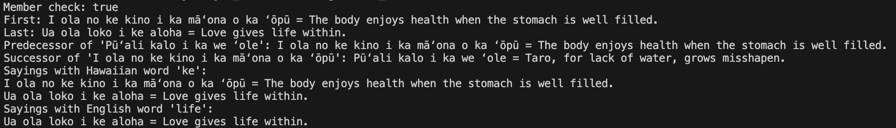

# ʻŌlelo Noʻeau Dictionary – Balanced Tree Implementation

#### ICS 311 - Assignment 2: Balanced Trees
#### Sydney Hashiro
#### Ka'ili Benavente

## Project Overview

This project implements a searchable, ordered dictionary of Hawaiian sayings using a balanced binary search tree.
Each saying includes:
- A Hawaian phrase
- Its English translation
- Explanations in both Hawaiian and English

This dictionary allows efficient insertions, lookups, and word based searches in both languages

## Data Structure and Design

We uesed a Java `TreeSet<Saying>` for our core storage structure. This is backed by a **Red-Black Tree**, providing:
| Operation        | Time Complexity |
|------------------|------------------|
| Insert           | O(log n)         |
| Search (member)  | O(log n)         |
| Predecessor/Successor | O(log n)   |
| Word search (`meHua`, `withWord`) | O(n · w) — linear scan by word |

The `Saying` class implements `Comparable` to allow Unicode-aware sorting by the Hawaiian phrase. Word-based searches are done by splitting the text and comparing individual words.

## Why Our Data Structure Is Efficient

We use Java’s `TreeSet`, which uses a Red-Black Tree, a type of self-balancing binary search tree. This tree gives us:

- O(log n) insertions, deletions, and lookups
- Sorted order traversal (for First/Last, Predecessor/Successor)
- Efficient word search is handled with a linear scan of all nodes, which is acceptable with a small expected dataset size

Red-Black Trees automatically maintain balance by rotating and coloring nodes that ensure us the longest path is never more than twice as long as the shortest. This keeps operations consistently fast even as the dataset grows.

This structure is ideal for our case where we prioritize ordering and efficient insert/search based on Hawaiian phrases.

## Work Division

### Sydney Hashiro
- Implemented `Saying.java`:
  - Fields: Hawaiian phrase, English translation, explanations
  - `compareTo`, `equals`, `hashCode` for sorting & deduplication
- Implemented `BalancedTreeDictionary.java`:
  - Methods: `insert()`, `member()`, `first()`, `last()`, `predecessor()`, `successor()`
  - Utilizes Java’s `TreeSet` for balanced ordering

### Ka'ili Benavente
- Implemented:
  - `meHua(word)` – finds sayings containing a Hawaiian word
  - `withWord(word)` – finds sayings containing an English word
- Created `Main.java`:
  - Populated the dictionary with sample data
  - Ran all test cases and printed output
- Verified functional correctness of all methods

## Features Implemented
- Insert sayings into a balanced tree
- Search for sayings by exact Hawaiian phrase
- Retrieve first, last, predecessor, and successor in alphabetical order
- Search sayings by Hawaiian or English word (substring match)

## Sample Output

Here is what the output looks like:

